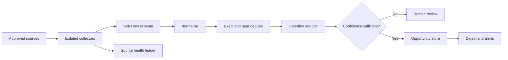

# Opportunity monitoring pipeline sample

Opportunity monitoring gets messy long before AI becomes the difficult part. The same tender can arrive through a portal and two newsletters, one source can quietly stop returning results, and a plausible summary can still be unsupported.

This repository is a small executable example of the controls I would validate before building a larger monitoring service. It uses local fixtures, so it can be run without credentials, paid APIs or live scraping.

## What it demonstrates

- Separate web and newsletter collectors behind a common interface
- Strict schemas that reject unexpected or malformed data
- URL normalisation and exact duplicate detection
- Conservative near-duplicate matching across sources
- Rules-based classification behind a replaceable classifier interface
- Low-confidence routing to a human-review queue
- Per-source success and failure health records
- A concise Markdown digest for non-technical review
- Tests covering duplicates, failures, source tracing and schema boundaries

The sample does not automate logged-in websites, call an LLM or scrape any real service. Those integrations belong behind the same interfaces after access, terms and expected volumes have been agreed.

## Pipeline



## Run it

```bash
python -m venv .venv
python -m pip install -e ".[dev]"
pytest
opportunity-monitor-demo
```

The demo processes fixture records representing a public web source and a newsletter. Two records refer to the same funding opportunity, so the output keeps one canonical record while preserving both source references.

## Design choices

**Rules before model calls.** Cheap deterministic checks handle known categories, keywords and deadlines. A production LLM adapter can then return the same validated classification schema.

**Duplicates retain evidence.** Deduplication combines records without discarding the URLs and source IDs that explain where the opportunity was found.

**Failures stay isolated.** A broken source updates its own health state without preventing other collectors from completing.

**Uncertainty is visible.** Low-confidence records enter a review queue instead of being presented as reliable matches.

## Production boundary

A production version would still need an agreed source registry, permitted connectors, encrypted secrets, durable persistence, a scheduler, observability, authentication, rate-limit policies and acceptance tests using representative private data.

This is an independent work sample and contains no client data or private project code. Please keep project communication on Upwork until a contract is in place.

