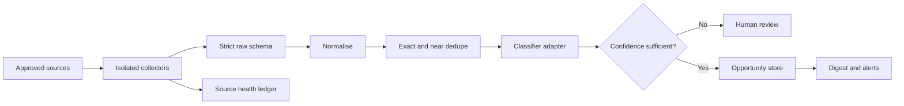

# Opportunity monitoring pipeline sample

[](https://github.com/LewisVibe/opportunity-monitoring-pipeline-sample/actions/workflows/tests.yml)
[](https://www.python.org/)
[](LICENSE)

Opportunity monitoring gets messy long before AI becomes the difficult part. The same tender can arrive through a portal and two newsletters, one source can quietly stop returning results, and a plausible summary can still be unsupported.

This repository is a small executable example of the controls I would validate before building a larger monitoring service. It uses local fixtures, so it can be run without credentials, paid APIs or live scraping.

> **Verified demo result:** 4 raw records become 3 canonical opportunities. The duplicated grant retains both source references, and the ambiguous item is held for human review. The repository has 15 automated tests.

## What it demonstrates

- Separate web and newsletter collectors behind a common interface
- Strict schemas that reject unexpected or malformed data
- URL normalisation and exact duplicate detection
- Conservative near-duplicate matching across sources
- Rules-based classification behind a replaceable classifier interface
- Low-confidence routing to a human-review queue
- Per-source success and failure health records
- A concise Markdown digest for non-technical review
- Tests covering duplicates, failures, source tracing and schema boundaries

The sample does not automate logged-in websites, call an LLM or scrape any real service. Those integrations belong behind the same interfaces after access, terms and expected volumes have been agreed.

## See it run

```bash
python -m venv .venv
python -m pip install -e ".[dev]"
pytest
opportunity-monitor-demo
```

The demo deliberately feeds the same grant through a portal fixture and a newsletter fixture. The output is condensed to:

```text
Opportunities: 3
Needs review: 1

public-grants-portal: healthy — 2 items
weekly-opportunities-newsletter: healthy — 2 items

Circular Innovation Grant
  priority: high
  sources retained: 2

Climate Procurement Summit
  priority: medium
  sources retained: 1

General network update
  priority: low
  review required: yes
```

This is the behaviour I would want to agree with a client before connecting live portals, mailboxes or paid model calls.

## How the pipeline is separated



Each boundary can be replaced without rewriting the rest of the workflow:

| Boundary | Included here | Production implementation |
| --- | --- | --- |
| Collection | Local web and newsletter fixtures | Approved APIs, RSS, mailbox APIs, normal HTTP or permitted Playwright flows |
| Classification | Deterministic rules returning a strict schema | LLM adapter returning the same validated schema, with confidence thresholds |
| Duplicate control | Canonical URLs and conservative title similarity | Persistent source IDs, fingerprints and conflict checks |
| Health tracking | In-memory per-source ledger | Durable run history, stale-source alerts and operational metrics |
| Output | Markdown digest and review queue | Database, staff dashboard, email/Teams alerts and exports |

## What the tests protect

The test suite covers malformed data, strict schema boundaries, URL canonicalisation, exact and near-duplicate handling, event-title precedence, review thresholds, source traceability, deterministic IDs and failure isolation.

A deliberately broken collector is also tested. Its failure is recorded while healthy sources continue to produce results.

## Repository map

```text
src/opportunity_monitor/
  collectors.py       source interface and fixture collectors
  models.py           strict input, classification and output schemas
  normalization.py    URL and title normalisation
  dedupe.py           exact and conservative near-duplicate handling
  classifier.py       replaceable deterministic classifier
  ledger.py           per-source health state
  pipeline.py         orchestration and review routing
  digest.py           human-readable output
tests/
  test_pipeline.py    15 behavioural tests
docs/
  architecture.md     production boundaries and design notes
  source-onboarding.md
```

## Design choices

**Rules before model calls.** Cheap deterministic checks handle known categories, keywords and deadlines. A production LLM adapter can then return the same validated classification schema.

**Duplicates retain evidence.** Deduplication combines records without discarding the URLs and source IDs that explain where the opportunity was found.

**Failures stay isolated.** A broken source updates its own health state without preventing other collectors from completing.

**Uncertainty is visible.** Low-confidence records enter a review queue instead of being presented as reliable matches.

## Production boundary

A production version would still need an agreed source registry, permitted connectors, encrypted secrets, durable persistence, a scheduler, observability, authentication, rate-limit policies and acceptance tests using representative private data.

This is an independent work sample and contains no client data or private project code. Please keep project communication on Upwork until a contract is in place.

